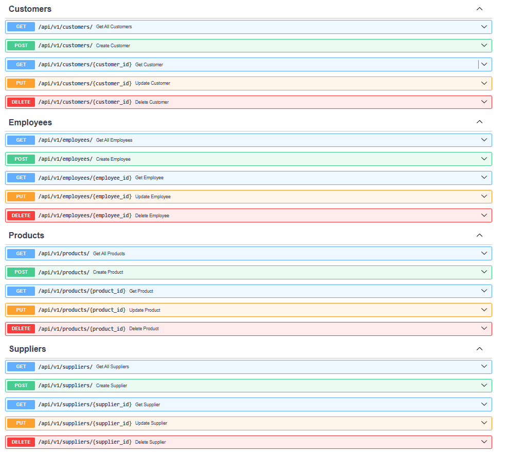

# Ecommerce API with Fast API Framework

A simple Ecommerce API built with Fast API Framework

## Demo

> [!IMPORTANT]
> The Render.com free plan may experience a short delay (approximately 1 minute) when starting up. Please be patient for the initial access.

- **Render.com**
	- [Swagger](https://ecommerce-api-hkdl.onrender.com/docs/)


## API Endpoints


| Endpoint                             | HTTP Method | Path                                    | Description                      |
|--------------------------------------|-------------|-----------------------------------------|----------------------------------|
| Get All Customers                    | GET         | `/api/v1/customers/`                    | Get all customer                 |
| Create Customer                      | POST        | `/api/v1/customers/`                    | Create customer                  |
| Get Customer by ID                   | GET         | `/api/v1/customers/{customer_id}/`      | Get detail customer              |
| Update Customer                      | PUT         | `/api/v1/customers/{customer_id}/`      | Update customer                  |
| Delete Customer                      | DELETE      | `/api/v1/customers/{customer_id}/`      | Delete customer                  |
| Get All Employees                    | GET         | `/api/v1/employees/`                    | Get all employee                 |
| Create Employee                      | POST        | `/api/v1/employees/`                    | Create employee                  |
| Get Employee by ID                   | GET         | `/api/v1/employees/{employee_id}/`      | Get detail employee              |
| Update Employee                      | PUT         | `/api/v1/employees/{employee_id}/`      | Update employee                  |
| Delete Employee                      | DELETE      | `/api/v1/employees/{employee_id}/`      | Delete employee                  |
| Get All Products                     | GET         | `/api/v1/products/`                     | Get all product                  |
| Create Product                       | POST        | `/api/v1/products/`                     | Create product                   |
| Get Product by ID                    | GET         | `/api/v1/products/{product_id}/`        | Get detail product               |
| Update Product                       | PUT         | `/api/v1/products/{product_id}/`        | Update product                   |
| Delete Product                       | DELETE      | `/api/v1/products/{product_id}/`        | Delete product                   |
| Get All Suppliers                    | GET         | `/api/v1/suppliers/`                    | Get all supplier                 |
| Create Supplier                      | POST        | `/api/v1/suppliers/`                    | Create supplier                  |
| Get Supplier by ID                   | GET         | `/api/v1/suppliers/{supplier_id}/`      | Get detail supplier              |
| Update Supplier                      | PUT         | `/api/v1/suppliers/{supplier_id}/`      | Update supplier                  |
| Delete Supplier                      | DELETE      | `/api/v1/suppliers/{supplier_id}/`      | Delete supplier                  |
| Swagger UI                           | -           | `/docs/`                                |                                  |

## Screenshots 




## Installation

1. **Clone the repository:**

   ```bash
   git clone https://github.com/doansilinh/ecommerce_api.git
   ```

2. **Navigate to the project directory:**

   ```bash
   ecommerce-api
   ```

3. **Create a virtual environment:**

   ```bash
   python -m venv venv
   ```

4. **Activate the virtual environment:**

   On Windows:

   ```bash
   venv\Scripts\activate
   ```

   On macOS and Linux:

   ```bash
   source venv/bin/activate
   ```

5. **Install dependencies:**

   ```bash
   pip install -r requirements.txt
   ```

## Usage

1. **Run Alembic migrations:**

   ```bash
   alembic revision --autogenerate -m "init"
   alembic upgrade head
   ```

   This will apply any pending database migrations.

2. **Run the FastAPI development server:**

   ```bash
   python main.py
   ```

   The API will be accessible at [http://127.0.0.1:8000/](http://127.0.0.1:8000/)

3. **Access the Swagger UI and ReDoc:**

   - Swagger UI: [http://127.0.0.1:8000/docs/](http://127.0.0.1:8000/docs/)
